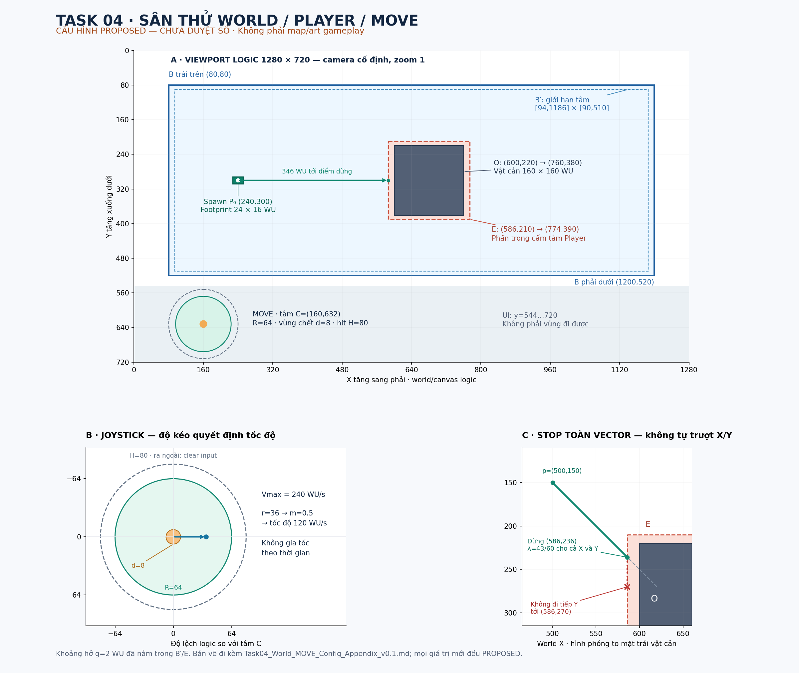

# Task 04 — Ghi nhận phê duyệt cấu hình DEV

**Ngày phê duyệt:** 27/09/2026 · **Chủ dự án:** phê duyệt trực tiếp trong cuộc trò chuyện triển khai.
**Trạng thái hiện hành:** C01–C07 APPROVED_FOR_DEV_IMPLEMENTATION / QA NOT RUN.
**configId:** T04-DEV-WM-CFG-P01 · revision 0.1.

Chủ dự án đã duyệt toàn bộ C01–C07 và cách diễn giải AC05/06/08/09 trong bản phụ lục bên dưới: tọa độ sân/vật cản/spawn; footprint 24×16 WU, g=2; joystick C=(160,632), R=64, d=8, H=80; Vmax=240 WU/giây active; analog sau dead zone, không gia tốc; dừng toàn vector tại tiếp xúc đầu tiên, không axis slide; camera/FIT/resize; lifecycle và sai số kiểm thử.

Ra khỏi H hủy gesture và phải chạm mới. Delta âm/non-finite hoặc trên 1000 ms dẫn tới ERROR/retry **chỉ trong sân thử DEV**. Không mở rộng policy sang game phát hành, không sửa clock foundation; nếu native Phaser không tương thích, phải đưa bằng chứng trước khi thay đổi.

**Ghi nhận trước code:** 18 AC dưới đây đã đối chiếu nguyên văn với §7 Task04_World_MOVE_Scope_AC_v0.1.md, không thay/nới AC. Remote remake/phieng-loi-v2 và checkout rà soát đều ở c45f3b2d860db1f92efc038d0a94532f818f0f69 tại lần kiểm tra 27/09/2026. Checkout có thay đổi có sẵn public/audio/chapter-02-mua-he-track-01.mp3; triển khai trong worktree/nhánh task riêng, không reset/revert công việc đó.

Giữ 44 baseline riêng với test mới theo 22 kịch bản. Oracle độc lập với MOVE đang kiểm, synthetic chỉ bổ sung; phải có pointer browser điều khiển actor Phaser thật. Bàn giao SHA/base/diff, CI/artifact đúng SHA, AC matrix, ảnh/trace và evidence input/collision/resize/pause/cleanup/renderer cho QA độc lập. Phê duyệt cấu hình không phải PASS QA.

Không art thật, chase, PHÀ ƠI, kinh tế/OCOP hoặc sửa Task HS-01 đã PASS. Không merge/phát hành. **F12: ACCEPTED_WITH_OWNER_WAIVER.**

## Bản cấu hình v0.1 được phê duyệt — giữ nguyên để truy vết

Phần bên dưới là snapshot nguyên trạng ngày 26/09/2026. Các nhãn PROPOSED, WAITING_FOR_OWNER_APPROVAL, câu “chờ duyệt trước code” và trạng thái NOT IMPLEMENTED trong snapshot mô tả thời điểm soạn, được bản ghi phê duyệt hiện hành phía trên thay thế đối với C01–C07. Không còn quyết định cấu hình C01–C07 bị để mở; nguyên văn 18 AC và các con số giữ nguyên. Kết quả triển khai/CI/QA được ghi riêng theo SHA, không viết ngược vào snapshot này.

---

# Task 04 — Phụ lục cấu hình sân thử world / Player / MOVE

**Tên hồ sơ:** Task04_World_MOVE_Config_Appendix_v0.1.md  
**Ngày:** 26/09/2026 · **Trạng thái:** DIRECTION APPROVED / CONFIG PROPOSED / NOT IMPLEMENTED / NOT RUN.  
**Nguồn AC:** Task04_World_MOVE_Scope_AC_v0.1.md, bản hiện hành đã đọc trong lượt này, §7.  
**Baseline hồ sơ:** c45f3b2d860db1f92efc038d0a94532f818f0f69, remake/phieng-loi-v2; Task 03 PASS / INTEGRATED. Lượt tài liệu này không xác minh lại HEAD/CI.  
**F12:** ACCEPTED_WITH_OWNER_WAIVER, không ghi PASS.

## 1. Phê duyệt hướng và giới hạn của phụ lục

Chủ dự án đã duyệt hướng cả tám nhóm T04-D01–D08: sân thử DEV độc lập world/Player/MOVE; hình học kỹ thuật; joystick điều khiển tốc độ; va chạm tĩnh; camera cố định; lifecycle/pause/cleanup riêng. Đây không phải phê duyệt con số, thuật toán chi tiết hoặc lệnh bắt đầu code.

**Mọi giá trị mới về tọa độ, kích thước, tốc độ, khoảng hở, input, delta và sai số trong phụ lục/bản vẽ đều PROPOSED, chờ chủ dự án duyệt trước code.** Các số lịch sử 1280×720 viewport, 18 AC, 44 baseline và 20 vòng lifecycle được dẫn từ nguồn, không phải cấu hình gameplay mới. Khi dùng cùng kích thước để bố trí sân/input, bố trí mới vẫn PROPOSED.

Bản gốc §6 còn ghi tất cả Dxx OPEN: đó là trạng thái trước phê duyệt hướng hiện tại. Phụ lục ghi nhận phê duyệt mới, giữ phần cấu hình chưa duyệt; không ghi đè nguồn hoặc thay nội dung 18 AC.

| Nhóm | Hướng đã duyệt | Chi tiết PROPOSED tại đây |
|---|---|---|
| D01 | Foundation DEV độc lập; HS-01 vẫn HANDOFF | Entry /phieng-loi?dev=world-move và bộ config fixture |
| D02 | Hình học kỹ thuật, không art thật | Một sân, một vật cản, một dấu điểm chân + overlay footprint |
| D03 | World-space riêng, geometry/spawn được duyệt trước code | Đơn vị, tọa độ và bản vẽ §2 |
| D04 | Một joystick touch/mouse | Hit area, vùng chết, công thức và mất quyền input §3 |
| D05 | **Một tốc độ tối đa**, tương thích joystick; không gia tốc theo thời gian | Vmax, active delta và sai số §3/§6 |
| D06 | Dừng khi va chạm, không tự trượt | Cắt toàn vector tại tiếp xúc đầu tiên; không xử lý tiếp riêng X/Y §4 |
| D07 | Camera cố định/FIT, resize không đổi world | Camera/input transform và clear gesture §5 |
| D08 | Pause/lock có owner; run/session mới; cleanup; không save | Bảng lifecycle, validation, retry §6 |

**Loại trừ giữ nguyên:** map làng thật, art/animation Player, HeeSun/chase/contact/capture, trigger HS-01, PHÀ ƠI, kinh tế/quán/khách/xu/đói/OCOP, audio, recovery, save, Book và SKIP ALL. Không consumer chase_requested; không import/copy/adapt legacy; không sửa Task HS-01 đã PASS. Bản vẽ dưới đây là tài liệu QA, không phải asset gameplay.

## 2. Bản vẽ sân và bảng tọa độ — PROPOSED

Bản vẽ có ba phần: sân trong viewport logic; joystick phóng to; đường chéo bị dừng. Trục X tăng sang phải, Y tăng xuống dưới. Tọa độ trong bảng là giá trị chuẩn; độ dày nét/vòng đánh dấu trên hình chỉ để đọc.

### 2.1. Bộ cấu hình nhận dạng và geometry

**configId đề nghị:** T04-DEV-WM-CFG-P01; revision 0.1; status PROPOSED. Tên này chỉ thuộc hồ sơ, chưa tạo config/module trong repo.

**Đơn vị đề nghị:** WU (world unit), độc lập CSS pixel và pixel thiết bị. Camera đề nghị ánh xạ 1 WU thành 1 đơn vị canvas logic; đây không phải tỷ lệ map/art cuối cùng.

| Thành phần | Giá trị đề nghị | Diễn giải |
|---|---|---|
| Viewport logic hiện hành | 1280×720 | Giữ foundation; không suy thành map game cuối |
| Bounds sân B | Góc trái trên (80,80), góc phải dưới (1200,520) | Rộng 1120 WU, cao 440 WU; chỉ vùng này đi được |
| Vật cản O | (600,220) → (760,380) | Một hình chữ nhật 160×160 WU, đứng yên |
| Spawn P0 | (240,300) | Tọa độ điểm chân, không phải góc ảnh |
| Footprint Player | Rộng 24, cao 16 WU; offset (0,0) | AABB có tâm đúng điểm chân; nửa kích thước hx=12, hy=8 |
| Marker kỹ thuật | Chấm bán kính 4 WU + footprint outline | Không sprite/pose/anchor art; marker không quyết định collision |
| Khoảng hở g | 2 WU | Khoảng hở theo các trục giữa footprint và bounds/vật cản |
| Camera | Scroll (0,0), zoom 1, rotation 0 | World không di chuyển theo CSS resize |
| Vùng UI điều khiển | y từ 544 đến 720 của canvas logic | Tách khỏi sân kết thúc ở y=520; không phải vùng world mới |
| Joystick | Tâm C=(160,632), chi tiết §3 | Nằm trong vùng UI; không chiếm hình học đi được |

Tất cả coordinates/marker/footprint/g kể trên là PROPOSED. Spawn, obstacle và bounds phải được validation trước world_ready; không sửa giá trị tự động để hợp lệ.

### 2.2. Vùng hợp lệ suy ra từ footprint và khoảng hở

Để QA kiểm cả footprint, không chỉ tâm:

- Tâm Player được ở trong hình chữ nhật **B′=[94,1186]×[90,510]**, suy từ B co vào (hx+g, hy+g)=(14,10).
- Vùng cấm cho tâm do vật cản là **phần trong E=(586,774)×(210,390)**, suy từ O nở ra (14,10).
- Biên E được phép chạm: lúc đó footprint còn cách vật cản đúng g theo trục tiếp cận. Đi vào phần trong E bị chặn.
- Đây là khoảng hở của hình chữ nhật, không phải collider tròn hoặc bán kính contact HeeSun. Không tính theo alpha của ảnh.
- Spawn (240,300) hợp lệ. Từ spawn đi phải cùng y sẽ dừng ở (586,300): mép phải footprint=598, còn cách mép vật cản x=600 đúng 2 WU.
- Tâm vẫn có thể vòng qua trên hoặc dưới E bằng điều khiển của người chơi. Không có tự tìm đường.

| Điểm/đường kiểm chứng | Kết quả geometry đề nghị |
|---|---|
| Bốn giới hạn tâm | x=94, x=1186, y=90, y=510 |
| Hành lang trên vật cản cho tâm | y từ 90 đến 210; khoảng mở 120 WU |
| Hành lang dưới vật cản cho tâm | y từ 390 đến 510; khoảng mở 120 WU |
| Đi phải từ spawn, giữ y=300 | Đi được 346 WU rồi dừng ở x=586 |
| Đi tự do 1 giây ở Vmax đề nghị | 240 WU; nhỏ hơn bề rộng sân, đủ kiểm được đường thoáng |
| Frame dài kiểm xuyên vật cản | P=(550,300), đề nghị dịch (240,0): endpoint (790,300) đã qua E nhưng đoạn đi phải bị chặn tại (586,300) |

Điểm P=(550,300) là tiền điều kiện test có thể đạt bằng MOVE. Nếu test biên đặt trực tiếp vị trí hoặc delta, bằng chứng phải ghi synthetic; không dùng nó thay test pointer thật.

## 3. Joystick và D05 — một tốc độ tối đa, tốc độ tức thời theo độ kéo

### 3.1. Vùng input đề nghị

Tọa độ input tính trong canvas logic sau phép đổi CSS→logic ở §5; không dùng screen pixel trực tiếp.

| Tham số | PROPOSED |
|---|---|
| Tâm cố định C | (160,632) |
| Bán kính kéo đạt tốc độ tối đa R | 64 đơn vị logic |
| Bán kính vùng chết d | 8 đơn vị logic |
| Bán kính hit/ownership H | 80 đơn vị logic |
| Bán kính núm hiển thị | 12 đơn vị logic; phần hiển thị, không collider |
| Vmax | **240 WU/giây active** |
| Kiểu input | Một pointer chủ; touch hoặc chuột trái; chưa keyboard/gamepad |
| Loại joystick | Tâm cố định; pointerdown trong hit circle nhận điều khiển ngay theo vị trí so với C |

Hit circle H khác vòng kéo R: đoạn từ R đến H vẫn cho tốc độ tối đa. Với cấu hình trên, vùng hit nằm x=80…240, y=552…712, hoàn toàn trong canvas và ngoài sân.

**Quyền pointer đề nghị:**

1. Chỉ nhận pointerdown mới bên trong H khi world ACTIVE, không global pause/lock. Pointerdown ngoài vùng hoặc trên UI khác không điều khiển Player.
2. Pointer chủ còn nằm trong H thì tính hướng/độ kéo; ra ngoài H hoặc canvas thì clear input và bỏ quyền. Quay lại bằng cùng lần giữ không tự di chuyển; cần pointerdown mới.
3. Pointer phụ không cướp hoặc thay đổi hướng của pointer chủ. Chạm Pause vẫn thực hiện global pause và clear input qua lifecycle.
4. Pointerup/cancel/lost capture, blur, pause, MOVE lock, resize/rotation đổi mapping, cancel/unmount đều clear input. Không dùng hướng cũ sau resume.
5. Sau collision vẫn giữ ý định input nếu pointer còn hợp lệ; displacement thực có thể bằng 0. Người chơi có thể đổi hướng để đi ra; collision không phải pointer cancellation.
6. Không nhân listener/native capture; chọn API binding trong triển khai sau nhưng phải giữ hành vi này. Không bật keyboard của foundation.

**Điểm cần chủ dự án duyệt rõ:** H=80 và luật ra khỏi H thì hủy gesture. Đây là diễn giải cụ thể cho AC06, không mặc định kéo ngoài vùng mãi mà vẫn chạy.

### 3.2. Công thức đề nghị

Gọi q là tọa độ pointer logic, w=q−C, r=sqrt(wx²+wy²).

- Không có pointer hợp lệ hoặc r≤d: magnitude m=0, vector u=(0,0).
- d<r≤H: m=clamp((r−d)/(R−d),0,1); hướng n=w/r; vector u=m·n.
- r>H: clear input theo §3.1, không chỉ clamp tốc độ.
- **Vận tốc mong muốn v=Vmax·u; tốc độ=sqrt(vx²+vy²)=Vmax·m.**
- **Đoạn dịch đề nghị Δp=v·Δt_active**, với Δt tính giây.

“Độ kéo” trong AC05 được diễn giải là **magnitude m sau xử lý vùng chết**, không phải r/R thô. Cùng r theo trục và theo đường chéo cho cùng tốc độ. Không chuẩn hóa mọi u khác 0 thành độ dài 1; làm vậy sẽ mất điều khiển tốc độ.

**D05 chỉ có một Vmax=240 PROPOSED.** Không có nhiều bậc tốc độ, tăng tốc theo thời gian, quán tính hoặc easing. Giữ cùng độ kéo lâu hơn chỉ tăng quãng đường, không tăng tốc. Thay độ kéo thì vận tốc mong muốn đổi ở lần native update kế tiếp nhận input; thả thì không còn bước MOVE từ input đó. Va chạm có thể làm tốc độ thực nhỏ hơn mong muốn hoặc bằng 0.

| r đề nghị | m | Tốc độ mong muốn |
|---:|---:|---:|
| 0 hoặc 8 | 0 | 0 WU/s |
| 22 | 0.25 | 60 WU/s |
| 36 | 0.50 | 120 WU/s |
| 50 | 0.75 | 180 WU/s |
| 64 hoặc 80 | 1 | 240 WU/s |
| Lớn hơn 80 | Input bị clear | 0 WU/s; cần gesture mới |

Các ví dụ 0.25/0.50/0.75 là điểm đo của công thức liên tục, không phải các nấc điều khiển. Không lấy bảng này làm acceleration curve.

## 4. D06 — dừng toàn vector tại tiếp xúc đầu tiên

### 4.1. Hợp đồng dừng đề nghị

Với tâm hợp lệ p và đoạn mong muốn Δp, xét **toàn đoạn p(t)=p+t·Δp, 0≤t≤1**, trên B′ và E của §2.2.

- Nếu toàn đoạn hợp lệ, đi tới p+Δp.
- Nếu đoạn sắp ra B′ hoặc vào phần trong E, tìm thời điểm tiếp xúc đầu tiên t_hit. Chọn **một hệ số λ=t_hit cho cả X và Y**, rồi p_new=p+λ·Δp.
- Khoảng hở g đã nằm trong B′/E. Không thêm backoff khác hoặc chặn sớm cả frame tại p khi còn đoạn hợp lệ phía trước.
- **Bỏ phần (1−λ)·Δp và thời gian MOVE còn dư của frame đó.** Không giữ phần dư để bù ở frame sau, không phản xạ/bounce, không tiếp tục thử X rồi Y hoặc Y rồi X.
- Giữ hướng chéo ép vào cùng mặt ở frame tiếp theo: λ=0, cả hai thành phần displacement bằng 0. Không trượt dọc mặt chỉ vì một thành phần bị chặn.
- Nếu người chơi tự đổi sang hướng ra khỏi vật cản hoặc hướng tiếp tuyến hợp lệ, cho MOVE theo hướng mới. Đây là input mới về hướng, không phải hệ thống tự sinh slide; không bắt buộc thả pointer nếu quyền vẫn còn.
- Nếu đoạn chỉ chạm góc/đi tiếp tuyến mà không vào phần trong E và không ra B′ thì cho đi. Không coi mọi giao điểm với biên đóng là xuyên vật cản.
- Đồng thời chạm hai mặt/góc: lấy t_hit sớm nhất và dừng cả vector; không ưu tiên trục, không cần chọn một normal để tạo slide.
- Không nhận trạng thái ban đầu nằm trong vùng cấm rồi tự đẩy ra. Config/spawn sai phải ERROR; lỗi vị trí runtime phải báo lỗi, không teleport che lỗi.

Cách tính toán chi tiết có thể dùng kiểm tra đoạn với hộp được nở/co, nhưng phải chứng minh contract trên và sai số §7. Không mở physics plugin hoặc đưa resolver legacy vào.

### 4.2. Các ví dụ bắt buộc cho D06

Các số dưới đây là oracle hình học của cấu hình PROPOSED, chưa phải test runtime đã chạy.

| Trường hợp | p, Δp đề nghị | Kết quả chính xác |
|---|---|---|
| Đâm ngang trái vật cản | p=(550,300), Δp=(240,0) | t_hit=36/240=0.15; p_new=(586,300), bỏ 204 WU còn lại |
| Đi chéo gặp mặt trái | p=(500,150), Δp=(120,120) | t_hit=86/120=43/60; p_new=(586,236); **không** đi tiếp tới (586,270) |
| Tiếp tục ép chéo từ điểm dừng | p=(586,236), Δp=(120,120) | t_hit=0; p_new giữ (586,236), không tăng riêng Y |
| Chủ động đi xuống sát mặt trái | p=(586,236), Δp=(0,20) | p_new=(586,256); tiếp tuyến hợp lệ, không đi vào E |
| Chủ động đi ra | p=(586,236), Δp=(-20,0) | p_new=(566,236) |
| Đụng góc trái trên E | p=(566,190), Δp=(40,40) | t_hit=0.5; p_new=(586,210), không đi tiếp trục nào |
| Chỉ lướt góc E | p=(576,220), Δp=(20,-20) | Chạm (586,210) rồi đi ra; p_new=(596,200), không vào phần trong E |
| Chạm biên sân khi đi chéo | p=(1170,480), Δp=(30,30) | t_hit=16/30; p_new=(1186,496); **không** đi tiếp Y tới 510 |

Với ví dụ Δp=(120,120), độ dài là 120√2 WU, có thể sinh từ input chéo ở Vmax trong Δt=√2/2 giây. Không coi mỗi trục 120 là tốc độ tối đa riêng; norm của velocity vẫn bị giới hạn bởi Vmax.

### 4.3. Frame dài và phạm vi active delta đề nghị

- Tính MOVE bằng delta active của native Phaser update; không custom RAF, React render loop hoặc wall clock gameplay thứ hai.
- Khoảng delta được đề nghị nghiệm thu: **0≤Δt_active≤1000 ms mỗi update**. Không clamp âm thầm delta hợp lệ thành một frame ngắn; kiểm cả đoạn để không xuyên vật cản.
- Δt=0: không dịch. Delta âm/NaN/Infinity hoặc lớn hơn 1000 ms: đề nghị ERROR có lý do, giữ vị trí, clear input, chờ retry; không teleport hoặc chạy bù. Đây là policy kỹ thuật PROPOSED cần duyệt, không sửa foundation clock.
- Phần inactive do pause/hidden/pagehide không được đưa vào delta MOVE lúc resume. Mẫu input cũ bị clear, cần input mới; không có catch-up.
- Nếu native engine thực tế không cung cấp miền delta/semantics phù hợp contract, phải báo trước khi đổi guard/foundation; không âm thầm sửa AC. Injection delta dài chỉ là test synthetic của controller/geometry dưới native ownership.
- AC05 được kiểm trên cùng input không đổi, cùng tổng active delta và đường không vật cản. Trường hợp đổi input dùng từng khoảng input đã nhận; không yêu cầu hai lịch lấy mẫu input khác nhau cho quỹ đạo giống hệt.

1000 ms là ngưỡng đề nghị cho tính đúng của đoạn chuyển động, không phải target frame rate, timeout chase hoặc thời gian animation.

## 5. Camera / resize / mapping input — PROPOSED

Giữ camera cố định scroll=(0,0), zoom=1, rotation=0; viewport logic 1280×720 và FIT/CENTER_BOTH hiện hành. Không camera-follow, depth sorting hoặc projection isometric.

Nếu container CSS có kích thước W×H, đề nghị:

- s=min(W/1280,H/720).
- Canvas hiển thị rộng 1280s, cao 720s; căn giữa trong container.
- L=container.left+(W−1280s)/2; T=container.top+(H−720s)/2.
- Tọa độ logic q=((clientX−L)/s,(clientY−T)/s).
- Ngoài hình chữ nhật canvas hiển thị là letterbox, không tạo MOVE. Dùng client coordinates thống nhất với bounding rectangle thực, không trộn page/screen coordinates.
- Camera transform identity nên tọa độ logic trùng world khi quan sát sân; joystick vẫn là UI riêng trong không gian logic. Không nhân thêm devicePixelRatio vào world.

| Container CSS minh họa | s | Kích thước canvas CSS | Offset trong container |
|---|---:|---|---|
| 1280×720 | 1 | 1280×720 | (0,0) |
| 960×540 | 0.75 | 960×540 | (0,0) |
| 390×844 | 0.3046875 | 390×219.375 | (0,312.3125) |

Các kích thước container là ca test đề nghị, không định danh thiết bị đã QA. Portrait vẫn FIT landscape canvas; chưa làm layout gameplay portrait riêng.

**Resize/rotation làm thay đổi mapping:** đề nghị luôn clear gesture đang giữ và yêu cầu pointerdown mới. Giữ nguyên tọa độ world, bounds, obstacle, spawn, trạng thái pause/lock và lifecycle hiện hành; chỉ đổi mapping hiển thị/input. Không reset scene hoặc đưa actor về spawn vì resize. Input mới phải hit đúng joystick sau letterbox/rotation.

## 6. Lifecycle, ownership và validation — chi tiết PROPOSED

Không thay adapter/contracts hoặc Task 03 trong lượt này. Global pause vẫn do adapter sở hữu; world controller chỉ sở hữu tài nguyên world, quyền pointer và MOVE locks riêng.

| Tình huống | Hành vi cần duyệt/kiểm |
|---|---|
| Mount / StrictMode | BOOTING, input zero; chờ native scene và validation; không tạo actor/controller lần hai |
| Config hợp lệ, scene ready | Emit world_ready một lần/run; tạo một actor ở spawn. Readiness không có nghĩa đang ACTIVE nếu còn pause/lock |
| ACTIVE | Chỉ MOVE khi ready, run/session hiện hành, không global pause, không MOVE lock và pointer hợp lệ |
| Manual pause / hidden / pagehide | Thêm đúng lý do; clear pointer/vector; đứng yên. Không chạy movement delta hoặc cộng active movement time |
| Resume từng lý do | Không gỡ lý do khác; không replay world_ready; chỉ nhận input mới khi hết mọi chặn |
| MOVE lock | Token/owner độc lập; clear input. Gỡ một lock không gỡ lock khác hoặc resume Game |
| Input mất quyền | Clear trước update tiếp theo có thể dịch chuyển; không drift sau up/cancel/blur/ra vùng |
| Collision | Giữ input intent nếu pointer hợp lệ; chặn displacement theo §4. Không thêm pause/lock giả |
| Resize/rotation | Clear gesture, giữ world và pause/lock; tính mapping mới theo §5 |
| Cancel / unmount / route exit | Vô hiệu session/run trước cleanup; clear input, dọn actor/listener/update owned; không completion/chase/capture |
| Scene restart trong cùng Game | Run mới, cùng adapter session; về spawn với input zero; callback/input run cũ bị loại |
| Re-entry sau hủy toàn phiên | Chờ teardown barrier, Game/session mới, run mới, về spawn; không phục hồi vị trí cũ |
| Config lỗi trước ready | ERROR; không world_ready/MOVE; không clamp spawn, fallback config hoặc tự sửa geometry |
| Lỗi runtime/delta không hợp lệ | ERROR, vị trí cuối hợp lệ giữ nguyên, input zero, không thêm completion. Không thể “thu hồi” world_ready đã phát; không phát ready lần nữa trong run lỗi |
| Retry fixture | Phiên world mới với config hợp lệ; dọn phiên lỗi trước. Không ảnh hưởng retry manga, reveal hoặc flow HS-01 |

Validation đề nghị kiểm: mọi số hữu hạn; bounds/obstacle có kích thước dương; footprint dương/g≥0; footprint có chỗ trong sân; obstacle thuộc sân; spawn nằm trong B′ và ngoài phần trong E; 0≤d<R≤H; hit circle nằm trong vùng UI/canvas; Vmax>0; camera/config khớp cấu hình đã duyệt. Ví dụ config spawn đúng trên tâm vật cản phải ERROR, không dời ra mép.

Tập lý do pause và locks luôn được đọc ở thời điểm update; không lấy một cờ ready cũ thay cho trạng thái hiện tại. Không dùng phase HS-01 giả để test khóa MOVE.

Snapshot/ledger DEV kế thừa đề xuất nguồn: configId, session/run, lifecycle hiện hành, pause/lock owners, pointer/vector, vị trí/footprint, delta active, displacement mong muốn/thực, collision fraction, camera transform và tài nguyên owned. Đây là yêu cầu bằng chứng của task sau, không lệnh tạo store/event bus chung.

## 7. Sai số và tiêu chuẩn đo đề nghị

Không dùng screenshot để thay kiểm chứng geometry. Vị trí thực của actor/footprint phải khớp dữ liệu quan sát; diagnostics đẹp nhưng actor không chạy là FAIL.

| Phép đo | Ngưỡng PROPOSED | Cách dùng |
|---|---|---|
| Oracle công thức/geometry với input và delta kiểm soát | Sai số tuyệt đối ≤10⁻⁶ WU trên mỗi tọa độ | Dùng cho đoạn dừng, góc/tiếp tuyến và config; không làm tròn vị trí mỗi frame |
| Biên/collider | Tâm không vượt B′ hoặc vào E quá 10⁻⁶ WU | Footprint vẫn không xuyên vật cản thật; khoảng hở 2 WU chỉ sai số tính toán này, không cho lấn 0.05 WU |
| Quãng đường free MOVE bằng pointer browser thật | Sai số vector cuối ≤0.05 WU so với oracle từ input đã nhận và tổng active delta | Không dùng thời gian sleep/wall time làm active time. Oracle dựa công thức §3, không lấy displacement báo sẵn làm expected |
| Tốc độ trung bình với input cố định | ≤0.1 WU/s; cửa sổ active đề nghị từ 1 giây | Cùng magnitude trục/chéo; không dùng sai số này để bỏ kiểm không diagonal boost |
| Input mapping CSS→logic | Sai số ≤0.5 đơn vị logic trong kiểm browser | Ca toán học r=d/R/H và ngay hai phía dùng tọa độ kiểm soát, không lấy 0.5 làm vùng chết mới |
| Khi pause/lock/input zero/collision ép vào mặt | Vị trí không đổi, tối đa 10⁻⁶ WU sai số đo | Không cho trôi mỗi frame đến khi sai số cộng dồn lớn |
| Renderer với cùng input/delta/config kiểm soát | Chênh vị trí ≤0.05 WU | WebGL/Canvas/AUTO fallback giữ cùng semantics; không so hai lần bấm tay có timing khác nhau |
| Lifecycle/count | Đúng tuyệt đối | world_ready một lần/run; Game live≤1; owned resources về 0 sau teardown; không stale callback |
| Event/cleanup | Đúng thứ tự, không đặt timeout thay kết quả | Đợi tín hiệu dispose/teardown thật rồi đo; không ngủ cố định để che rò rỉ |

Miền delta nghiệm thu đề nghị 0–1000 ms đã nêu ở §4.3. Test free MOVE dùng cùng tổng delta với các phân đoạn khác nhau; test đường có collision đối chiếu đoạn bị cắt, không kỳ vọng luôn đi đủ Vmax·m·time.

Sai số trên là đề nghị cần chủ dự án duyệt; QA không tự nới để làm xanh. Nếu browser automation không cung cấp input chính xác sát biên, ghi giới hạn và dùng kiểm toán học bổ sung; vẫn phải có đường MOVE bằng pointer thật.

## 8. Nguyên văn 18 AC nguồn — không sửa

Bảng dưới sao nguyên văn §7 của Task04_World_MOVE_Scope_AC_v0.1.md. Các mã D01…D08 trong cột phụ thuộc là T04-Dxx, không phải Dxx downstream HS-01. Không sửa expected/assertion hoặc diễn giải bản sao thành AC mới đã PASS.

| AC | Given / When | Then — kết quả có thể kiểm thử | Quyết định phụ thuộc |
|---|---|---|---|
| T04-AC01 | Dev entry được chọn; kiểm tra import graph và production preview với cùng query | World module chỉ chạy DEV; production không có harness/debug API/module Task 04; không request asset mới; graph không tới/copy legacy | D01–D02 |
| T04-AC02 | Mount với config hợp lệ trong StrictMode | Một actor, một bộ điều khiển MOVE, một world_ready/run sau validation; ghi configId/session/run; input zero trước ready | D02–D03,D08 |
| T04-AC03 | Config thiếu/sai, spawn ngoài bounds hoặc footprint chồng vật cản; retry bằng config hợp lệ | ERROR không ready/MOVE; không clamp/teleport/fallback âm thầm; retry tạo phiên mới, không hồi callback phiên lỗi | D03,D06,D08 |
| T04-AC04 | Người dùng tác động pointer MOVE trên actor đang ACTIVE; sau đó thả | Actor thật đổi vị trí đúng hướng/magnitude được duyệt; thả thì đứng yên; không chỉ thay diagnostics hoặc tween trang trí | D04–D05 |
| T04-AC05 | Input cùng độ lớn trên trục/chéo; cùng tổng active time với các phân đoạn delta khác nhau, không vật cản | Quãng đường theo vP × magnitude × active time trong sai số được duyệt; không diagonal boost hoặc phụ thuộc số frame | D04–D05 |
| T04-AC06 | Pointer up/cancel/lost capture, blur, thao tác ngoài vùng MOVE, pointer phụ hoặc chạm UI pause | Input về zero khi mất quyền; không tự trôi/nhận tap UI thành MOVE; pointer phụ không cướp active pointer | D04,D08 |
| T04-AC07 | Di chuyển tới mọi cạnh/góc bounds từ nhiều hướng | Toàn footprint ở vùng hợp lệ; không chỉ tâm actor nằm trong bounds; theo response đã duyệt, không teleport | D03,D06 |
| T04-AC08 | Di chuyển cắt vật cản, sát mép/góc; một frame dài có thể vượt bề dày vật cản | Không xuyên đoạn bị chặn; stop/clearance đúng config; không bounce/slide ngoài quyết định; đường thoáng vẫn đi được | D03,D05–D06 |
| T04-AC09 | Resize, letterbox, portrait↔landscape khi đứng yên/đang giữ input | World position/geometry không đổi do CSS; camera/input mapping đúng; gesture mất hiệu lực được clear; không claim F12 PASS | D03–D04,D07–D08 |
| T04-AC10 | Manual pause khi đang MOVE; chờ rồi resume | Position, displacement/active movement time đứng yên khi pause; không catch-up; resume không tự dùng input cũ | D05,D08 |
| T04-AC11 | Hidden/pagehide; manual+hidden cùng bật, gỡ theo cả hai thứ tự | Không MOVE khi còn bất kỳ global pause nào; bỏ manual không xóa hidden và ngược lại; trở lại cần input mới | D08 |
| T04-AC12 | Hai chủ sở hữu giữ khóa MOVE; gỡ từng khóa, xen manual pause | Không MOVE đến khi hết khóa và global pause; unlock không resume engine/xóa khóa khác; không cần giả phase HS-01 | D08 |
| T04-AC13 | Cancel/unmount/route exit trong BOOTING, ACTIVE và PAUSED | Vô hiệu session/run trước cleanup; actor/input/listener/update owned được dọn; hủy không emit completion/chase/capture | D08 |
| T04-AC14 | Restart scene hoặc re-entry ngay; giao lại input/callback từ run/session cũ | Run/session mới không bị sửa vị trí/trạng thái; restart thay run; re-entry thay session và về spawn; không save/resume vị trí cũ | D03,D08 |
| T04-AC15 | 20 vòng mount/move/pause/cancel/re-entry và scene restart | Max live Game ≤1; không nhân actor/controller/listener; tài nguyên Task 04 về zero sau teardown, không callback mồ côi | D08 |
| T04-AC16 | Thực hiện toàn bộ hành động world; quay lại hs-flow chạy đến HANDOFF | Không consumer chase mới, không HeeSun/capture/progression/save/unlock; hs-flow vẫn một request sau cleanup và dừng; voice unbound, không SKIP ALL | D01 |
| T04-AC17 | Chạy MOVE/bounds/obstacle trên AUTO/WebGL, Canvas và AUTO fallback hiện có | Cùng geometry/input semantics, actor nhìn thấy đúng camera; không lỗi console/runtime; kiểm thử browser không thay QA thiết bị thật | D02–D07 |
| T04-AC18 | Bàn giao candidate SHA cho QA | Nguyên 44 test baseline PASS và kết quả test mới báo riêng; AC matrix, đúng SHA/run/artifact; không báo chase/full-flow PASS; F12 vẫn waiver | Tất cả |

### 8.1. Đối chiếu phụ lục với từng AC

**Kết luận tài liệu:** chưa đề nghị thay hoặc nới AC nào. Một số từ khóa cần khóa cách hiểu bằng phụ lục trước code, đặc biệt AC05/06/08/09. Nếu QA nhận thấy cách hiểu dưới đây không tương thích nguyên văn, ghi CONFLICT/NEEDS_DECISION và trình chủ dự án; không tự sửa AC nguồn.

| AC gốc | Đối chiếu phụ lục | Điểm cần làm rõ/khóa trước code |
|---|---|---|
| AC01 | §1: DEV độc lập, procedural, không legacy | Entry/config và cách giữ production exclusion; không đưa ảnh bản vẽ vào game/bundle |
| AC02 | §2, §6: một marker/controller, ready một lần/run | Chốt validation/configId; ready có thể đồng thời paused, không tự phát lại khi resume |
| AC03 | §2.2, §6: spawn phải hợp lệ với toàn footprint + g | ERROR cả trường hợp tâm nằm trong sân nhưng footprint/khoảng hở không hợp lệ; không clamp. Retry tạo phiên mới |
| AC04 | §3: analog pointer→actor thật | Một Vmax, tốc độ tức thời Vmax·m; vận tốc đổi ở update kế tiếp, không tween/gia tốc |
| AC05 | §3.2, §4.3, §7 | **vP trong AC là Vmax; magnitude là m sau vùng chết.** Giữ đúng công thức gốc, no diagonal boost. Chốt active delta và sai số, không dùng raw r/R |
| AC06 | §3.1, §5–6 | **Ngoài MOVE:** down ngoài bị bỏ qua; pointer chủ rời H thì clear; pointer phụ không cướp. Pause UI gây clear qua pause. Không mặc định capture cho kéo ngoài H vô hạn |
| AC07 | §2.2, §4 | Kiểm toàn footprint + g tại mọi cạnh/góc, không chỉ tâm. Khóa clearance 2/sai số đề nghị trước code |
| AC08 | §4 | **Dừng bằng một λ cho cả X/Y; bỏ phần dư, không axis sliding.** Chạm tiếp tuyến hợp lệ được đi; frame dài phải kiểm toàn đoạn dù endpoint bên kia vật cản |
| AC09 | §5 | Cụ thể hóa clear mọi gesture khi mapping đổi; giữ world. FIT/portrait test không chứng minh thiết bị thật hoặc F12 PASS |
| AC10 | §4.3, §6 | Delta MOVE không chứa khoảng pause; fresh input sau resume; đứng yên phải được kiểm bằng vị trí thật |
| AC11 | §6 | Manual/hidden/pagehide gỡ độc lập; thử cả thứ tự, không dựa ready cũ |
| AC12 | §6 | MOVE locks có owner/token, không sửa global pause; thử hai owner và manual pause cùng lúc |
| AC13 | §6 | Invalidate generation trước cleanup, thử BOOTING/ACTIVE/PAUSED; hủy không completion |
| AC14 | §6 | Restart thay run/cùng session; re-entry và retry toàn fixture thay session/về spawn. Không dùng quy tắc này đóng reload HS-01 |
| AC15 | §6–7 | Giữ nguyên **20 vòng**, live Game≤1 và zero owned resources. Không thay bằng số vòng ít hơn hay chỉ screenshot |
| AC16 | §1, §6 | Giữ HANDOFF và một request sau cleanup của Task 03; không consumer, art/audio/downstream hoặc kinh tế |
| AC17 | §5, §7 | Cùng config/semantics trên renderer; ghi đường AUTO fallback thực, không giả renderer flag; thiết bị thật vẫn riêng |
| AC18 | §9–10 | 44 baseline và test mới báo riêng; đúng SHA/run/artifact sau triển khai, F12 waiver. Chưa có SHA runtime Task 04 trong lượt này |

**Các điểm giải nghĩa trọng tâm, không sửa AC:** AC05 về Vmax/magnitude; AC06 về ranh giới giữ pointer; AC08 về stop toàn vector và tangent; AC09 về clear input sau resize. Các con số và policy invalid-delta/retry cũng cần được duyệt; không coi việc duyệt hướng D01–D08 là đã chốt chúng.

## 9. Baseline và kế hoạch test mới — tách riêng

### 9.1. Giữ nguyên 44 test baseline

| Nhóm | Số test đã có | Cách báo |
|---|---:|---|
| Foundation | 16 | Hồi quy, không đổi assertion để chứa Task 04 |
| Reveal | 7 | Hồi quy Task 01 |
| Manga | 5 | Hồi quy Task 02 |
| Integration reveal→manga→HANDOFF | 16 | Hồi quy Task 03, không nghiệm thu chase |
| **Tổng baseline** | **44** | Không phải 44 test world/MOVE |

Nguồn dẫn lại evidence Task 03: [Verify #36116753550](https://github.com/nguyenvandung10x7-eng/A-pa-ch-i-GPS/actions/runs/36116753550) và [artifact pl00-browser-evidence](https://github.com/nguyenvandung10x7-eng/A-pa-ch-i-GPS/actions/runs/36116753550/artifacts/10855821204). Không mở/kiểm tra lại CI trong lượt tài liệu; đây không phải run Task 04.

### 9.2. Test mới đề nghị — 22 kịch bản, NOT IMPLEMENTED / NOT RUN

Đây là kịch bản kiểm thử dự kiến, không cam kết số test case cuối cùng. Parameterize có thể tạo nhiều test hơn; số PASS phải lấy từ artifact của SHA runtime sau này. Không cộng 22 vào baseline để báo 66 PASS.

| ID | Kịch bản mới | AC |
|---|---|---|
| T04-N01 | Dev entry đúng; production với cùng query không world/debug/module/asset mới; kiểm import/copy legacy | 01 |
| T04-N02 | StrictMode mount: đúng một actor/controller/ready, input zero, configId/session/run | 02 |
| T04-N03 | Thiếu/sai config, spawn ngoài B′ hoặc trong E, footprint/g sai; ERROR và retry phiên mới | 03 |
| T04-N04 | Pointer thật điều khiển m=0.25/0.5/0.75/1; actor dịch đúng, thả đứng | 04–05 |
| T04-N05 | r quanh d/R/H: dead zone, saturate, ngoài H clear; không biến 0.5 tolerance thành luật input | 04,06 |
| T04-N06 | Cùng magnitude trên trục/chéo, cùng tổng delta chia đoạn khác nhau trên đường thoáng | 05 |
| T04-N07 | Giữ lâu không tăng tốc; đổi độ kéo cập nhật vận tốc tức thời; release không inertia | 04–05 |
| T04-N08 | up/cancel/lost capture/blur, down ngoài vùng, pointer phụ, Pause UI; mất quyền và fresh input | 06 |
| T04-N09 | Mọi cạnh/góc B′, whole footprint + g; đi chéo chạm biên không đi tiếp riêng Y/X | 07–08 |
| T04-N10 | Vật cản tiếp cận từ các mặt/góc; stop đúng E, đường thoáng đi được | 08 |
| T04-N11 | Chuỗi ví dụ §4.2: diagonal stop, tiếp tục ép, đổi input tangent/away, lướt góc | 08 |
| T04-N12 | Synthetic frame 1000 ms từ (550,300) đi phải: endpoint dự kiến qua vật cản nhưng actual dừng (586,300) | 08 |
| T04-N13 | Delta 0, ở ngưỡng, âm/non-finite/>1000: theo policy đã duyệt, không clamp/catch-up âm thầm | 03,05,10 — chi tiết bổ sung cần duyệt |
| T04-N14 | Resize/letterbox/portrait↔landscape khi idle/drag/paused; world không đổi, hit mapping đúng, gesture clear | 09 |
| T04-N15 | Manual pause đang MOVE: vị trí/time đứng; resume không trôi/catch-up, cần input mới | 10 |
| T04-N16 | Hidden/pagehide + manual chồng nhau, gỡ cả hai thứ tự; callback/input cũ không kéo actor | 11 |
| T04-N17 | Hai owner khóa MOVE, unlock từng cái, xen manual; không tự resume Game | 12 |
| T04-N18 | Cancel/unmount/route exit trong BOOTING/ACTIVE/PAUSED: invalidate trước cleanup, không completion | 13 |
| T04-N19 | Restart và re-entry ngay; callbacks/input run/session cũ; retry khác session, spawn đúng | 14 |
| T04-N20 | Đúng 20 vòng mount/move/pause/cancel/re-entry + restart; Game≤1, actor/listener/controller không nhân | 15 |
| T04-N21 | Quay lại hs-flow: reveal/manga/cleanup/một chase_requested/HANDOFF nguyên trạng; không writes downstream | 16 |
| T04-N22 | Toàn MOVE/bounds/obstacle trên AUTO/WebGL, Canvas và AUTO fallback; console/trajectory/semantics | 17 |

AC18 là yêu cầu bàn giao đủ báo cáo/config/evidence/SHA, không được coi là một chức năng chỉ cần test smoke. AC01–17 có test mới riêng; AC18 kiểm gói bàn giao.

Input qua browser thật và native Phaser update phải chứng minh actor di chuyển. Synthetic delta/set-position/callback chỉ bổ sung ca biên, ghi nhãn rõ trong evidence. Oracle đoạn/hình học không thay đường input thật; test tự kiểm diagnostics mà không quan sát actor là chưa đủ.

## 10. Bằng chứng QA tương lai và các mục cần duyệt

### 10.1. Gói bàn giao sau khi được phép triển khai

- Xác minh baseline/HEAD thực tế trước code; dừng báo nếu khác phạm vi được duyệt, không reset/revert về mốc hồ sơ.
- Lập nhánh task riêng theo workflow đã duyệt sau này; chưa tạo nhánh/commit/PR trong lượt này.
- Bàn giao SHA/base/diff, configId + bản cấu hình được chủ dự án duyệt, link Verify đúng SHA và artifact.
- Báo **baseline 44/44** riêng với **test Task 04 mới passed/failed/skipped**; không đổi số dự kiến thành kết quả.
- Artifact mới có AC mapping nguyên văn, overlay/trajectory, pointer/magnitude, active delta, desired/actual displacement, collision fraction, pause/lock/session/run, cleanup counters, renderer, console/trace khi lỗi.
- Typecheck/build/Verify và Production Security Audit/Tracked Secret Scan theo workflow hiện hành; không tự coi branch mới đã có push CI nếu whitelist chưa thêm.
- Nếu cần đổi shared foundation/guard hoặc phần đã PASS, nêu xung đột cụ thể và dừng trình trước; không sửa source AC/baseline để phù hợp code.
- Không kết luận chase/capture/HS-01 COMPLETE từ world_ready hoặc technical collision. F12 giữ ACCEPTED_WITH_OWNER_WAIVER.

### 10.2. Checklist chủ dự án duyệt trước code

| Mục | Phần cần duyệt |
|---|---|
| C01 — Sân/Player kỹ thuật | configId; B/O/spawn; marker; footprint 24×16, g=2; vùng UI |
| C02 — Joystick | C, R=64, d=8, H=80; công thức m; pointer chủ rời H thì hủy gesture |
| C03 — D05 | Vmax=240 WU/s; một max với analog liên tục; không acceleration |
| C04 — D06 | Một λ cho cả vector, bỏ phần dư; stop đầu tiên; tangent/away do người chơi chọn; không axis slide |
| C05 — Camera/resize | Fixed identity/FIT; công thức mapping; clear gesture mỗi lần mapping đổi |
| C06 — Lifecycle/delta | Bảng §6; active delta 0–1000 ms; ERROR khi delta không hợp lệ; fresh input/retry/re-entry |
| C07 — QA | Sai số §7; các cách hiểu AC05/06/08/09 và ca invalid-delta; 22 kịch bản mới tách baseline |

Tất cả C01–C07 hiện **PROPOSED / WAITING_FOR_OWNER_APPROVAL**. Chủ dự án đã duyệt hướng D01–D08, chưa duyệt bảng giá trị này. Task 04 chưa READY_FOR_IMPLEMENTATION; hồ sơ này không cấp phép code.

Không cần chốt P01–P04 kinh tế để duyệt sân thử. Các quyết định xu–đói vẫn nằm ở bản ghi riêng, không bổ sung vào 18 AC. “Mưu sinh sau recovery” không được đóng bởi phụ lục này.

## 11. Kết quả lượt lập phụ lục

Chỉ tạo tài liệu cấu hình đề nghị và hình minh họa tọa độ; kiểm tra nhất quán toán học/bản sao AC, không chạy test gameplay. Nguyên văn 18 AC được giữ, 44 baseline chưa chạy lại. Không sửa repo, art đã nghiệm thu, Task HS-01, tài liệu nguồn hoặc runtime. Không merge/phát hành.

**F12: ACCEPTED_WITH_OWNER_WAIVER.**
